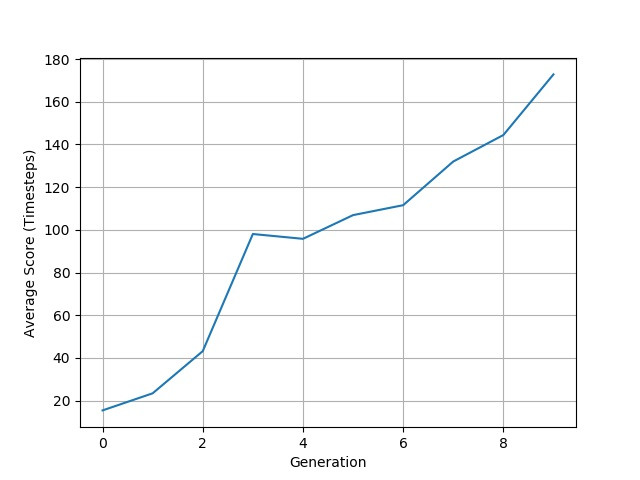

## CartPole_Q-Learning
Balancing CartPole-v1 from OpenAI Gym by means of Reinforcement Learning, 
specifically employing Epsilon-Greedy strategy for Q-Learning.

Refer to q_learning.pdf for more information about
Q-Learning.

## CartPole_Genetic
Genetic Algorithm/ Neural Network implementation for 
balancing CartPole-v1 from OpenAI Gym, based on 
Zachary Richardson's implementation.

## Running the codes:

python cartpole_q_learning.py
python cartpole_q_learning.py --episodes 1000 --alpha 0.1 --gamma 0.95

python cartpole_genetic.py
python cartpole_genetic.py --generations 10 --steps 500 --population 20 --mutation 0.01

## Dependency: 
Gym
